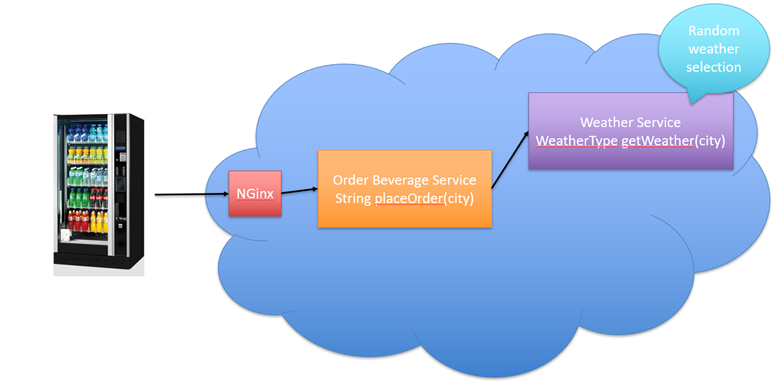

# Pre-requirements

- Docker
- Docker-compose
- Python 3.5+ (with asyncio and aiohttp)
- libssl-dev (apt-get install libssl-dev)
- libz-dev (apt-get install libz-dev)
- luarocks (apt-get install luarocks)
- luasocket (luarocks install luasocket
- Thrift 0.14.0 (./configure --with-lua --with-cpp --with-py)
-- (Thrift tutorial: https://www.youtube.com/watch?v=NK6hz2JM89w)

## Application Structure

# Cheatsheet on thrift 

To compile vending_machine.thrift:

thrift --gen cpp vending_machine.thrift

thrift --gen py vending_machine.thrift

thrift --gen lua vending_machine.thrift

# cheatsheet on docker commands

1. To create docker image from docker file:
$ docker build -t yourusername/repository-image-name .
2. List docker images:
$ docker images -a
3. Retag the image with a version number: 
$ docker tag yourusername/repository-image-name yourdockerhubusername/repository-image-name:version_1
4. Docker-Hub login:
$ docker login
5. Push the local image to docker-hub
$ docker push abiodunjames/example-node-app:v1 
6. List docker containers:
$ docker ps -a

Ref: 
1. https://stackify.com/docker-build-a-beginners-guide-to-building-docker-images/
2. https://www.digitalocean.com/community/tutorials/how-to-remove-docker-images-containers-and-volumes

# cheatsheet on docker-compose

1. Run docker-compose script to run all the containers:
$ docker-compose up
2. Stop docker containers that started from docker-compose script:
$ docker-compose down

